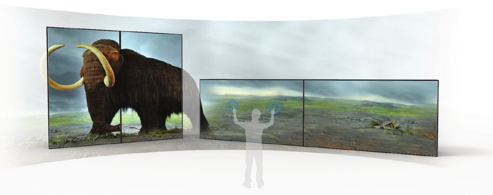

# Interaktivní projekční stěna (IPS) - Firmware

IPS je projekční zařízení s prvky interakce využívající systému zadní projekce pro vytvo-
ření obrazu o rozměrech 4x2m (viz obr. 1). Je určené především pro prezentaci
3D obsahu (3D modely, 3D scény) v paměťových institucích jako jsou muzea nebo tam,
kde je potřeba prezentovat 3D obsah interaktivní formou na velkoplošném obrazu. IPS
využívá sadu senzorických prvků pro detekci přítomnosti diváků a jejich pohybu v okolí
stěny a dále senzory pro detekci zvukových signálů a světelných podmínek v okolí stěny.

**Tento repozitář obsahuje zdrojové kódy firmwaru IPS.**

## Poznámky k instalaci
Balíček emt-sdk musí být stažen a nainstalován do projektu manuálně.
 1. Stáhněte balíček SDK z [emt-sdk](https://github.com/iimcz/emt-sdk)
 2. Otevřete Unity v "safe" módu (editor se vás při startu optá)
 3. Nainstalujte balíček pomocí manažeru balíčků a možnosti "local tarball"
 4. Restartujte Unity (opusťte "safe" mód)

## Poznámky k Unity
Soubory jako např. TextMeshPro jsou v repoziráři zahrnuty, jelikož by bez nich projekt nešel otevřít a nenacházejí se v jiném Unity balíčku.

## Rozcestník další dokumentace
 - [Dokumentace IPS](https://raw.githubusercontent.com/iimcz/ipw-firmware/master/Doc/ipw_dokumentace.pdf)
 - [Výrobní dokumentace](https://raw.githubusercontent.com/iimcz/ipw-firmware/master/Doc/IPW_projekcni_box_vyrobni_dokumentace.pdf)
 - [Návod na sestavení boxu](https://raw.githubusercontent.com/iimcz/ipw-firmware/master/Doc/IPW_navod_na_sestaveni.pdf)
 - [Dokumentace zdrojových kódů](https://raw.githubusercontent.com/iimcz/ipw-firmware/master/Doc/EMT_SDK_programatorska_dokumentace.pdf)
 - [Protokol o testování IPS](https://raw.githubusercontent.com/iimcz/ipw-firmware/master/Doc/PTF-DCGI-FVZ-03-2021.pdf)
 - [Modely pro 3D tisk]()
